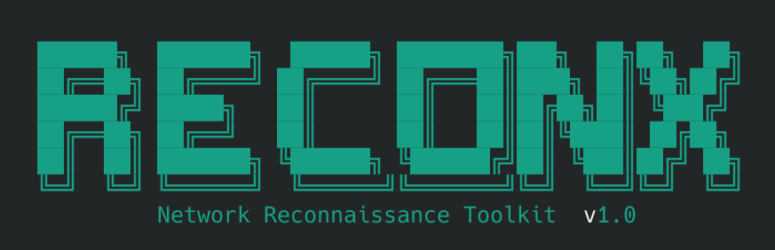

# ReconX

<p align="center">
  
</p>

A powerful CLI tool for network reconnaissance, vulnerability scanning, CVE lookup, risk assessment, and report generation —- all powered by Nmap.

## Features

- **Host Discovery** -- ping sweeps, ARP scans, live host detection
- **Port Scanning** -- SYN, TCP connect, full 65535 port scans
- **Service Version Detection** -- fingerprint service versions
- **OS Fingerprinting** -- remote OS detection with confidence scoring
- **Stealth Scanning** -- decoys, fragmentation, MAC spoofing, source-port manipulation, custom TTL, badsum, timing templates
- **NSE Vulnerability Scanning** -- Nmap Scripting Engine vuln scripts
- **CVE Lookup** -- online CVE database enrichment (via CIRCL API) with local caching
- **Risk Scoring** -- multi-factor risk assessment per host and overall
- **Report Generation** -- HTML & PDF reports
- **Scheduled Scanning** -- cron-based scheduling with daemon mode
- **Interactive Menu** -- TUI mode for exploring scan results
- **Dark Dashboard** -- standalone HTML dashboard for scan visualization

## Installation

### 1. Install Nmap (required)

```bash
sudo apt update && sudo apt install -y nmap   # Debian/Ubuntu
sudo dnf install -y nmap                       # Fedora/RHEL
brew install nmap                              # macOS
```

### 2. Install ReconX

```bash
# Clone the repository
git clone https://github.com/Nikku2716/ReconX.git
cd ReconX

# Install in editable mode (recommended) or directly
pip install -e .
```

This installs the `reconx` command globally — no need to `cd` into the project or use `./cli.py`.

### 3. (Optional) PDF report support

```bash
pip install fpdf2
```

## Quick Start

```bash
# Show help
reconx --help

# Scan a subnet
reconx scan {Target}

# Interactive menu
reconx menu

# Full report
reconx all
```

## Usage

### Scanning

```bash
# Basic scan (SYN scan on top 1000 ports + version + OS detection)
reconx scan {Target}

# Quick scan — host discovery only
reconx scan {Target} --quick

# Deep scan — all 65535 ports
reconx scan {Target} --deep

# Scan with banner grabbing
reconx scan {Target} --banners
```

### Stealth Scanning

```bash
# Full stealth mode (SYN, slow timing, random decoys, fragmentation, random MAC)
reconx scan target.com --stealth

# Custom decoy IPs
reconx scan 10.0.0.1 --decoy 10.0.0.2,10.0.0.3,10.0.0.4

# Fragment packets + custom source port
reconx scan {Target} --fragment --source-port 53

# MAC spoofing + custom TTL + timing
reconx scan {Target} --spoof-mac 0 --ttl 64 --timing 1

# Bad checksum scan
reconx scan {Target} --badsum

# Full stealth with all options
reconx scan target.com --stealth --decoy RND:5 --source-port 1234 --data-length 100 --ttl 128

# Stealth vulnerability scan
reconx vuln-scan {Target} --stealth
```

### Vulnerability Scanning

```bash
# Run Nmap NSE vulnerability scripts
reconx vuln-scan {Target}
```

### CVE Lookup

```bash
# Lookup CVEs for all discovered services
reconx cve-lookup --all

# Lookup CVEs for a specific service
reconx cve-lookup --service ssh --version "OpenSSH 7.4"
```

### Risk Assessment

```bash
# Show overall and per-host risk scores
reconx risk-score
```

### Report Generation

```bash
# HTML report
reconx report --html

# PDF report (requires fpdf2)
reconx report --pdf

# Custom output path
reconx report --html --output ./my_report.html
```

### Scheduled Scanning

```bash
# List schedules
reconx schedule list

# Add a daily scan
reconx schedule add {Target} daily

# Weekly scan with deep profile
reconx schedule add {Target} weekly --profile deep

# Remove schedule
reconx schedule remove 1

# Toggle schedule on/off
reconx schedule toggle 1

# Run daemon (checks every 60s for due scans)
reconx schedule daemon
```

### Results Display

```bash
reconx status        # Scan summary
reconx hosts         # Live hosts
reconx ports         # Open ports
reconx services      # Service versions
reconx os            # OS fingerprints
reconx vulns         # Vulnerability findings
reconx phases        # Scan phase breakdown
reconx all           # Full report
reconx menu          # Interactive menu
```

### Data Management

```bash
# Clear all cached scan data, raw output, reports, and CVE cache
reconx clear
```

### Uninstall

```bash
# Remove ReconX and optionally clean up scan data
reconx uninstall
```

Or remove manually:

```bash
pip uninstall reconx
rm -rf /path/to/ReconX
```

## Project Structure

```
ReconX/
├── pyproject.toml          # Package config & entry point
├── scripts/
│   ├── __init__.py
│   ├── cli.py              # Main CLI — scanning, display, orchestration
│   ├── cve_lookup.py       # CVE database querying (CIRCL API)
│   ├── report_gen.py       # HTML & PDF report generation
│   ├── risk_scoring.py     # Multi-factor risk assessment engine
│   └── scheduler.py        # Cron-based scan scheduler
├── scans/
│   ├── raw/                # Raw Nmap XML/gnmap/nmap output
│   ├── parsed/             # Parsed tabular data (hosts, ports, vulns)
│   └── cve_cache/          # Cached CVE lookups (24h TTL)
├── reports/                # Generated HTML/PDF reports
├── requirements.txt        # Python dependencies
└── README.md               # This file
```

## Requirements

- **Python 3.8+**
- **Nmap 7.x** — must be installed and on PATH
- **fpdf2** — optional, for PDF report generation

## Workflow

```
┌──────────────┐      ┌──────────────┐      ┌──────────────┐
│  Host        │      │  Port/       │      │  Service     │
│  Discovery   │────▶│  Service     │────▶│  Version     │
│  (nmap -sn)  │      │  Scan        │      │  Detection   │
└──────────────┘      └──────────────┘      └──────────────┘
                                                  │
┌──────────────┐     ┌──────────────┐             │
│  OS          │     │  NSE Vuln    │◀───────────┘
│  Fingerprint │     │  Scan        │
└──────────────┘     └──────┬───────┘
                            │
                    ┌───────▼───────┐
                    │  CVE          │
                    │  Enrichment   │
                    └───────┬───────┘
                            │
                    ┌───────▼───────┐
                    │  Risk         │
                    │  Assessment   │
                    └───────┬───────┘
                            │
                    ┌───────▼───────┐
                    │  Report       │
                    │  (HTML/PDF)   │
                    └───────────────┘
```

## Security Notes

- Scanning networks without explicit authorization is illegal in most jurisdictions
- Stealth features are designed for authorized penetration testing and CTF environments only
- All scan results are stored locally; no data is sent to third parties (CVE lookups use the public CIRCL API)
- Input validation is enforced on all targets to prevent shell injection

## License

[GNU GPLv3](LICENSE)
